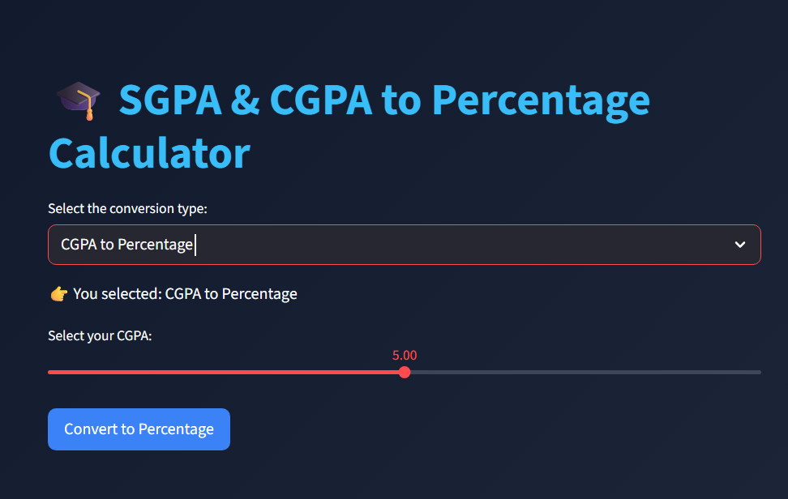

# 🎓 SGPA & CGPA to Percentage Calculator  

An interactive and modern **SGPA & CGPA to Percentage Converter** built using **Streamlit** and **Python**.  
This tool allows students to easily convert their **SGPA or CGPA** into **percentage** with a clean dark-themed UI and motivational quotes based on performance.  

  

---



---

## 🚀 Features  
- 🔄 Convert **SGPA → Percentage** or **CGPA → Percentage**  
- 🎚️ User-friendly **slider input** for SGPA/CGPA selection  
- 🎨 Dark-themed, modern **Streamlit interface**  
- 📝 Instant percentage calculation with one click  
- 💡 **Motivational quotes** displayed based on your result  

---

## 🛠️ Tech Stack  
- **Python 3**  
- **Streamlit** → UI and dashboard  
- **Random** → For motivational quotes  

---

## 📦 Installation  

1. Clone the repository:  
   ```bash
   git clone https://github.com/your-username/sgpa-cgpa-percentage-calculator.git
   cd sgpa-cgpa-percentage-calculator
   ```

2. (Optional) Create a virtual environment:

   ```bash
   python -m venv venv
   source venv/bin/activate   # On Mac/Linux  
   venv\Scripts\activate      # On Windows  
   ```

3. Install dependencies:

   ```bash
   pip install -r requirements.txt
   ```

---

## ⚙️ Usage

1. Run the Streamlit app:

   ```bash
   streamlit run app.py
   ```

2. Select the conversion type:

   * **SGPA to Percentage**
   * **CGPA to Percentage**

3. Use the slider to enter your **SGPA/CGPA**.

4. Click **"Convert to Percentage"** to see your result.

5. 🎯 Get **motivational feedback** based on your score.

---

## 📊 Example Output

**For SGPA = 5.0**

* 🎯 Percentage = 42.50%
* 💡 Motivational Quote: *"Don't worry, success is a journey, not a race! 🚀"*

---

## 📝 Requirements

Create a `requirements.txt` file with:

```txt
streamlit
```

Then install with:

```bash
pip install -r requirements.txt
```

---

## 🤝 Contributing

Pull requests are welcome! For major changes, please open an issue first to discuss what you’d like to change.

---

## 📜 License

This project is licensed under the **MIT License** – feel free to use and modify.
